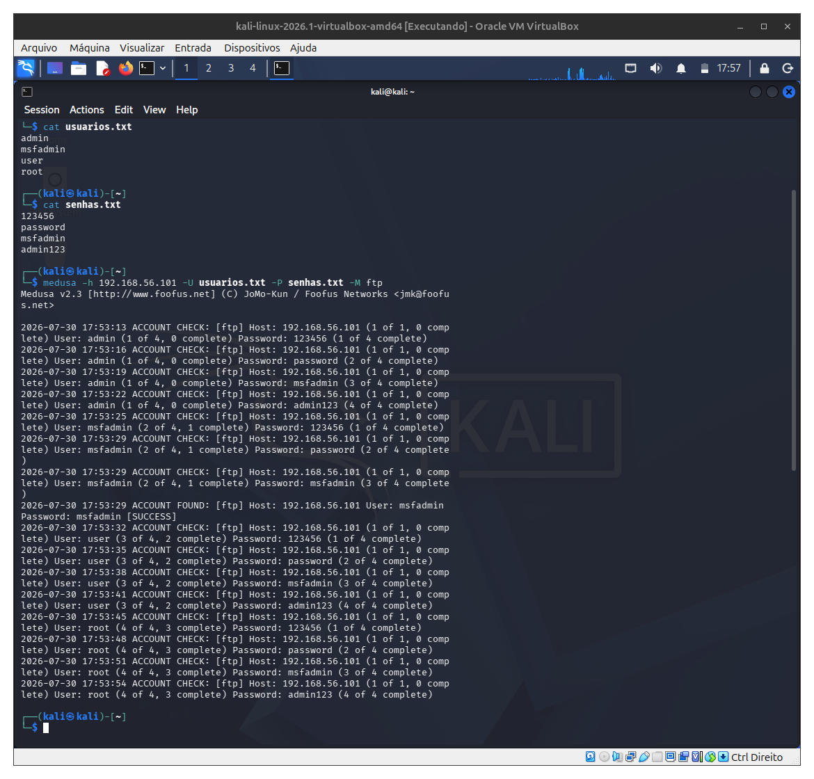
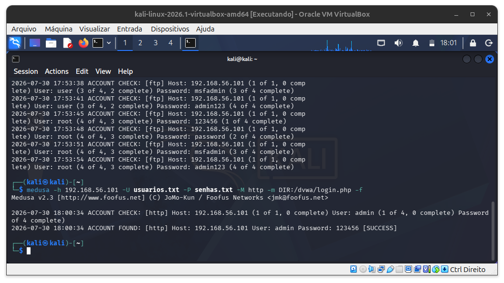
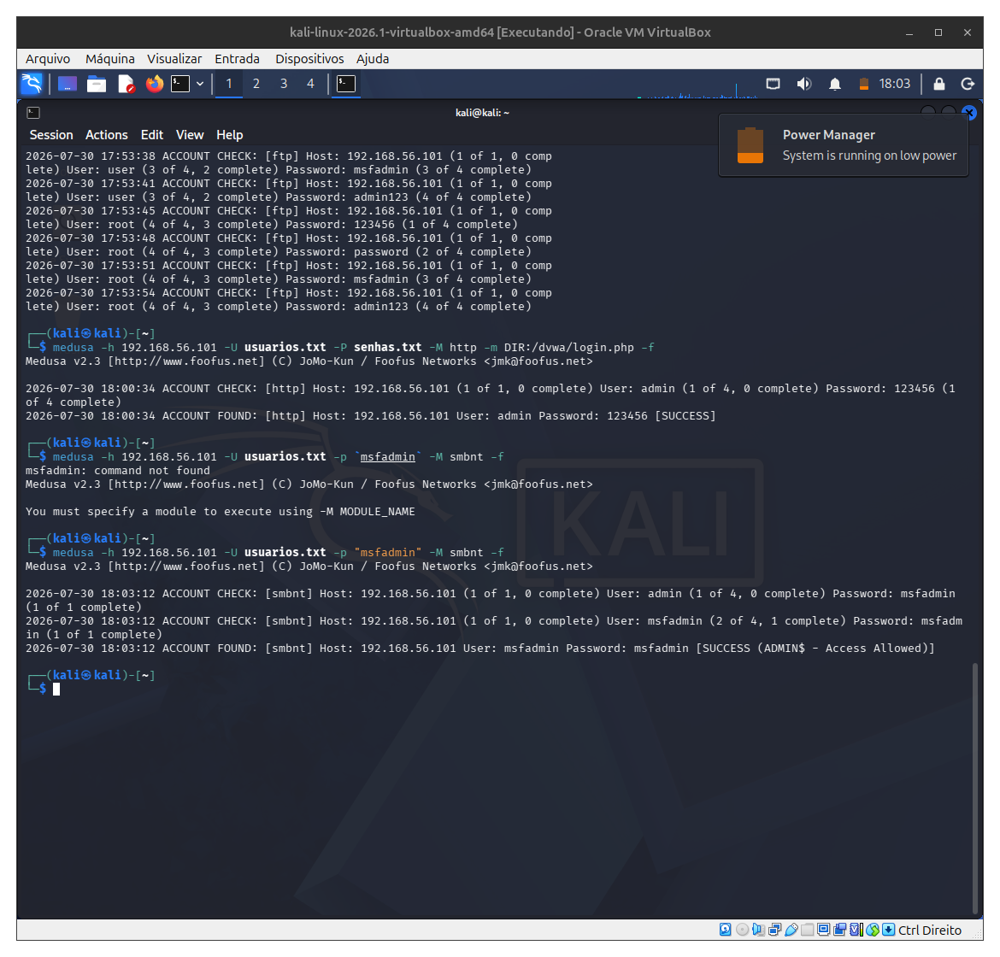

# Laboratório de Auditoria de Segurança com Kali Linux e Medusa
Projeto desenvolvido como parte do desafio da DIO, com o objetivo de compreender ataques de autenticação em ambiente controlado utilizando Kali Linux, Medusa, Metasploitable 2 e DVWA.

## 🎯 Objetivos

- Configurar um laboratório de testes utilizando VirtualBox.
- Utilizar o Kali Linux como máquina de auditoria.
- Explorar serviços vulneráveis disponibilizados pelo Metasploitable 2.
- Compreender o funcionamento da ferramenta Medusa.
- Documentar os testes realizados.
- Identificar vulnerabilidades relacionadas ao uso de credenciais fracas.
- Apresentar recomendações de mitigação.

  ## 🖥️ Ambiente Utilizado

| Item | Descrição |
|------|-----------|
| Virtualização | Oracle VirtualBox |
| Sistema atacante | Kali Linux 2026 |
| Sistema alvo | Metasploitable 2 |
| Aplicação Web | DVWA |
| Ferramenta | Medusa |
| Rede | Host-Only |

## 🌐 Topologia

Kali Linux
⬇
Host-Only Network
⬇
Metasploitable 2
├── FTP
├── SMB
└── DVWA

## 📁 Cenário 1 — Auditoria no serviço FTP

Foi realizado um teste de autenticação em ambiente controlado para demonstrar como credenciais fracas podem comprometer serviços FTP.

### Evidência

## 🌍 Cenário 2 — Aplicação Web (DVWA)

Foi realizado um teste de autenticação em uma aplicação web vulnerável (DVWA) para compreender os riscos associados ao uso de credenciais previsíveis.

### Evidência

## 🖥️ Cenário 3 — SMB

Foi realizado um teste de autenticação no serviço SMB em ambiente controlado para compreender o comportamento do serviço diante de credenciais válidas e inválidas.

### Evidência

## 📚 Aprendizados

Durante este laboratório foi possível compreender:

- a importância de políticas de senha fortes;
- os riscos associados ao uso de credenciais fracas;
- o funcionamento básico da autenticação em diferentes serviços;
- a importância da segmentação de redes;
- como ferramentas de auditoria auxiliam na validação da segurança de um ambiente controlado.

## 🛡️ Medidas de Mitigação

- Utilização de senhas fortes.
- Implementação de autenticação multifator (MFA).
- Limitação do número de tentativas de login.
- Monitoramento contínuo de logs.
- Aplicação de políticas de bloqueio de contas.
- Utilização de CAPTCHA em aplicações web.
- Remoção de credenciais padrão.
- Atualização periódica dos sistemas.

## ✅ Conclusão

O laboratório permitiu compreender, em ambiente isolado e exclusivamente educacional, como serviços que utilizam credenciais fracas podem estar suscetíveis a tentativas de autenticação indevida. Além da prática com o Kali Linux e o Medusa, o projeto reforçou a importância da adoção de boas práticas de segurança, como políticas de senhas robustas, autenticação multifator, monitoramento de eventos e atualização contínua dos serviços.

## 👨‍💻 Autor

**Kenya Tyeh**

Projeto desenvolvido como parte do desafio da Digital Innovation One (DIO).
